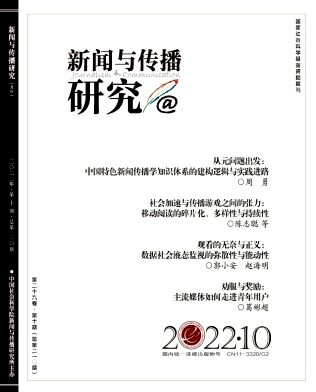

# 新闻传播学中文学术期刊投稿格式 Claude Code Skills

一组 [Claude Code](https://claude.ai/code) Skills，将论文 `.docx` 自动调整为指定期刊的投稿格式。每个子目录对应一本期刊，相互独立、按需安装。

## 包含的期刊

| 目录 | 期刊 | 封面 | 主要功能 |
|------|------|------|----------|
| [`xwycbyj-formatter/`](./xwycbyj-formatter/) | 《新闻与传播研究》 |  | 脚注体例统一、括注/APA/MLA/GB → 本刊格式、版面字体标题、修改报告 |

## 工作原理

采用**代码 + Claude 判断**的混合策略：

1. **结构抽取**（脚本）：读取 `.docx`，打印全部脚注、括注、标题层级、前置信息
2. **引文映射**（Claude 判断）：逐条把各式引文映射到目标格式，生成判断表 `citation_map.py`
3. **写回 + 报告**（脚本）：机械格式（字体/行距/页边距/脚注编号）+ 引文写回，产出新 `.docx` 和 Markdown 修改报告

> **铁律**：转换时只允许重排已有文献信息的顺序与标点，**严禁新增、补全或推断任何文献内容**（作者、年份、页码、出版社等）。信息缺失一律在修改报告中标记待人工复核，绝不擅自猜测。

## 安装

**前置依赖**

- [Claude Code](https://claude.ai/code)（CLI 版）
- Python 3.9+
- `pip install python-docx lxml`

**安装 Skill**

```bash
# 克隆仓库
git clone https://github.com/wgyang28/xinchuan-journal-formatter.git
cd xinchuan-journal-formatter

# 方法一：符号链接（推荐——仓库更新后自动生效）
ln -s "$(pwd)/xwycbyj-formatter" ~/.claude/skills/xwycbyj-formatter

# 方法二：直接复制
cp -R xwycbyj-formatter ~/.claude/skills/
```

## 使用

在 Claude Code 中说出触发词，skill 即自动启动：

- `"帮我把这篇论文调成新传研究的格式"`
- `"新闻与传播研究投稿格式"`
- `"调整格式 + 投稿"`

Skill 会询问输入文件路径，然后依次完成抽取 → 判断 → 写回，**只产出两个文件**：

```
原文件名_新传研究投稿版.docx
原文件名_新传研究投稿版_修改报告.md
```

原文件不会被覆盖。

## 新增期刊

1. 在仓库根目录新建子目录 `<期刊缩写>-formatter/`
2. 参照 `xwycbyj-formatter/` 的结构，替换 `references/` 里的规范文件和 `format_config.json`
3. 安装符号链接到 `~/.claude/skills/`
4. 更新本 README 的期刊列表
